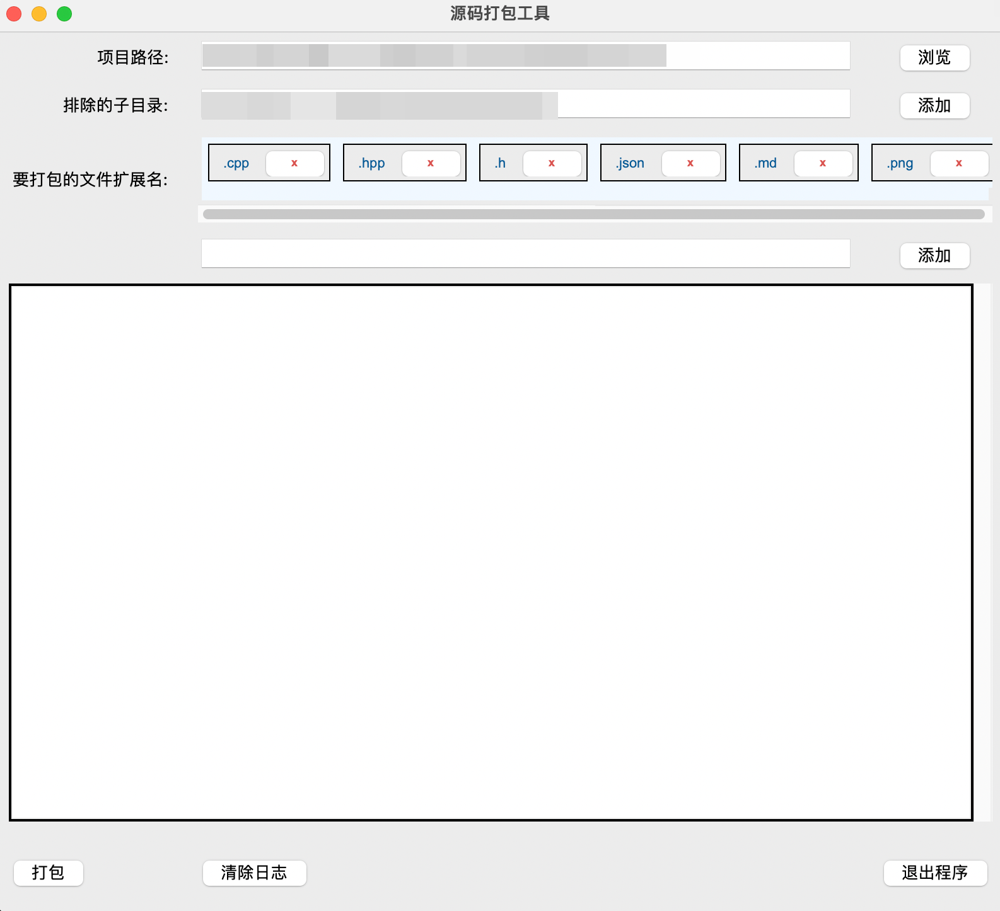

# 源码打包工具

## 项目简介

源码打包工具是一款用于将项目文件按照指定的文件扩展名和排除目录规则进行打包的工具。它提供了一个简单的图形用户界面，让用户可以轻松地选择项目路径、管理文件扩展名和排除的子目录，并生成打包后的压缩文件。

### 主要功能

- **选择项目路径**：通过浏览文件系统，选择要打包的项目路径。
- **管理文件扩展名**：添加、删除和显示要包含在打包中的文件扩展名。
- **排除子目录**：设置要排除在打包之外的子目录。
- **自动补全扩展名**：在添加扩展名时，自动补全缺失的 `.`。
- **日志输出**：显示打包过程中的日志信息，便于查看和调试。
- **动态界面调整**：界面元素可以根据窗口大小自动调整，确保最佳的用户体验。
- **配置管理**：支持保存和删除项目配置，方便快速加载常用设置。

## 安装和运行

### 环境依赖

在运行此工具之前，请确保您的系统已安装以下依赖项：

- Python 3.6 或更高版本
- `tkinter` 图形界面库（通常与 Python 一起安装）

### 安装步骤

1. 克隆项目代码：
   ```bash
   git clone https://github.com/shixukai/source-code-packer.git
   ```
2. 进入项目目录：
   ```bash
   cd source-code-packer
   ```

### 运行项目

在项目目录下执行以下命令启动图形界面：

```bash
python3 src/main.py
```

## 功能说明

### 选择项目路径

- 点击 `浏览` 按钮，打开文件选择对话框。
- 默认情况下，对话框会打开当前项目路径的上一级目录。
- 选择文件夹后，项目路径会更新为选择的文件夹路径。如果取消选择，保持原有的路径值不变。

### 管理文件扩展名

- 在 `文件扩展名` 输入框中输入扩展名，然后点击 `添加扩展名` 按钮。
- 如果输入的扩展名没有加 `.`，系统会自动在前面补全 `.`。
- 已添加的扩展名会以标签的形式显示在输入框下方，可以点击标签右侧的 `x` 按钮删除扩展名。

### 排除子目录

- 在 `排除的子目录` 输入框中手动输入要排除的目录名，用分号 `;` 分隔多个目录。
- 点击 `添加` 按钮，可以打开文件夹选择对话框，选择要排除的子目录。

### 配置管理

- 点击 `保存配置` 按钮，将当前项目路径、文件扩展名和排除子目录保存到配置文件中。
- 点击 `删除配置` 按钮，从配置文件中删除当前项目路径的配置。
- 当项目路径在配置文件中已存在时，保存操作会覆盖现有的配置。

### 打包操作

- 点击 `打包` 按钮，开始打包操作。
- 日志框会实时显示打包过程中的日志信息。
- 打包完成后，会弹出对话框，显示压缩包的生成路径，并提供 `打开` 按钮直接打开所在目录。

## 界面说明

### 主界面



- **项目路径**：用于选择和显示要打包的项目路径。
- **排除的子目录**：手动输入或通过文件选择对话框添加要排除的子目录。
- **文件扩展名**：输入要打包的文件扩展名并添加到列表中。
- **日志输出**：显示打包过程的详细日志信息。
- **保存配置**：保存当前的项目设置到配置文件中。
- **删除配置**：删除当前的项目设置。

### 标签管理

- **添加扩展名**：输入扩展名并添加到标签列表中。
- **删除扩展名**：点击标签上的 `x` 按钮，删除对应的扩展名。
- **自动补全**：系统会自动补全输入的扩展名的 `.`。

## 更新日志

### v1.1.0

- 添加了自动补全扩展名前的 `.` 功能。
- 改进了界面布局和动态调整机制。
- 增加了日志输出的清除功能。
- 添加了保存和删除配置功能。

### v1.0.0

- 初始版本发布。
- 实现了基本的项目路径选择、文件扩展名管理和排除子目录功能。
- 提供了简单易用的图形用户界面。

## 贡献

欢迎大家对本项目提出意见和建议，或者通过提交 PR 来改进项目。如果你有任何问题或想法，请随时联系我。

---

感谢您使用源码打包工具！
